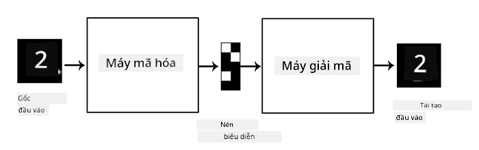
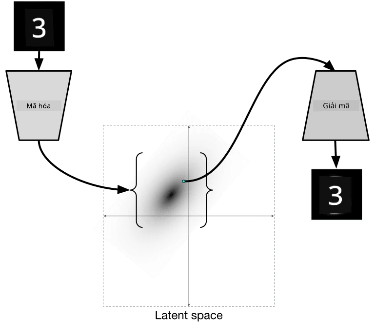
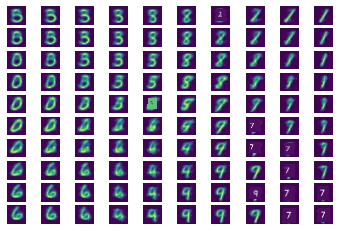
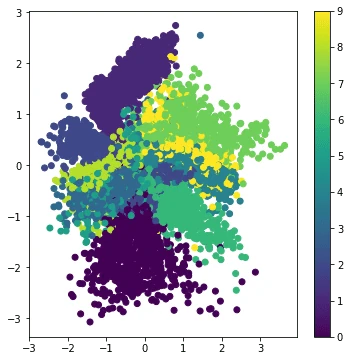

# Autoencoders

Khi huấn luyện CNN, một trong những vấn đề là chúng ta cần rất nhiều dữ liệu được gắn nhãn. Trong trường hợp phân loại hình ảnh, chúng ta cần phân chia hình ảnh thành các lớp khác nhau, điều này đòi hỏi sự nỗ lực thủ công.

## [Pre-lecture quiz](https://ff-quizzes.netlify.app/en/ai/quiz/17)

Tuy nhiên, chúng ta có thể muốn sử dụng dữ liệu thô (không được gắn nhãn) để huấn luyện các bộ trích xuất đặc trưng của CNN, điều này được gọi là **học tự giám sát**. Thay vì sử dụng nhãn, chúng ta sẽ sử dụng hình ảnh huấn luyện làm cả đầu vào và đầu ra của mạng. Ý tưởng chính của **autoencoder** là chúng ta sẽ có một **mạng mã hóa** chuyển đổi hình ảnh đầu vào thành một **không gian tiềm ẩn** nào đó (thường chỉ là một vector có kích thước nhỏ hơn), sau đó là **mạng giải mã**, với mục tiêu tái tạo lại hình ảnh gốc.

> ✅ Một [autoencoder](https://wikipedia.org/wiki/Autoencoder) là "một loại mạng nơ-ron nhân tạo được sử dụng để học cách mã hóa hiệu quả dữ liệu không được gắn nhãn."

Vì chúng ta đang huấn luyện autoencoder để nắm bắt càng nhiều thông tin từ hình ảnh gốc càng tốt nhằm tái tạo chính xác, mạng cố gắng tìm **embedding** tốt nhất của hình ảnh đầu vào để nắm bắt ý nghĩa.

> Hình ảnh từ [blog Keras](https://blog.keras.io/building-autoencoders-in-keras.html)

## Các trường hợp sử dụng Autoencoders

Mặc dù việc tái tạo hình ảnh gốc có vẻ không hữu ích tự thân, nhưng có một số trường hợp autoencoders đặc biệt hữu ích:

* **Giảm chiều của hình ảnh để trực quan hóa** hoặc **huấn luyện embedding hình ảnh**. Thông thường autoencoders cho kết quả tốt hơn PCA, vì nó tính đến tính chất không gian của hình ảnh và các đặc trưng phân cấp.
* **Khử nhiễu**, tức là loại bỏ nhiễu khỏi hình ảnh. Vì nhiễu mang theo rất nhiều thông tin không cần thiết, autoencoder không thể đưa tất cả vào không gian tiềm ẩn tương đối nhỏ, do đó nó chỉ nắm bắt phần quan trọng của hình ảnh. Khi huấn luyện bộ khử nhiễu, chúng ta bắt đầu với hình ảnh gốc và sử dụng hình ảnh có nhiễu được thêm vào một cách nhân tạo làm đầu vào cho autoencoder.
* **Siêu phân giải**, tăng độ phân giải hình ảnh. Chúng ta bắt đầu với hình ảnh có độ phân giải cao và sử dụng hình ảnh có độ phân giải thấp hơn làm đầu vào cho autoencoder.
* **Mô hình sinh**. Sau khi huấn luyện autoencoder, phần giải mã có thể được sử dụng để tạo ra các đối tượng mới bắt đầu từ các vector tiềm ẩn ngẫu nhiên.

## Autoencoders Biến thể (VAE)

Autoencoders truyền thống giảm chiều của dữ liệu đầu vào bằng cách nào đó, tìm ra các đặc trưng quan trọng của hình ảnh đầu vào. Tuy nhiên, các vector tiềm ẩn thường không có ý nghĩa nhiều. Nói cách khác, lấy ví dụ bộ dữ liệu MNIST, việc xác định các chữ số tương ứng với các vector tiềm ẩn khác nhau không phải là nhiệm vụ dễ dàng, vì các vector tiềm ẩn gần nhau không nhất thiết phải tương ứng với cùng một chữ số.

Mặt khác, để huấn luyện các mô hình *sinh*, tốt hơn là có một sự hiểu biết về không gian tiềm ẩn. Ý tưởng này dẫn chúng ta đến **autoencoder biến thể** (VAE).

VAE là autoencoder học cách dự đoán *phân phối thống kê* của các tham số tiềm ẩn, được gọi là **phân phối tiềm ẩn**. Ví dụ, chúng ta có thể muốn các vector tiềm ẩn được phân phối theo chuẩn với một số giá trị trung bình zmean và độ lệch chuẩn zsigma (cả giá trị trung bình và độ lệch chuẩn đều là các vector có một số chiều d). Bộ mã hóa trong VAE học cách dự đoán các tham số này, sau đó bộ giải mã lấy một vector ngẫu nhiên từ phân phối này để tái tạo đối tượng.

Tóm lại:

 * Từ vector đầu vào, chúng ta dự đoán `z_mean` và `z_log_sigma` (thay vì dự đoán độ lệch chuẩn, chúng ta dự đoán logarit của nó)
 * Chúng ta lấy mẫu một vector `sample` từ phân phối N(zmean,exp(zlog\_sigma))
 * Bộ giải mã cố gắng giải mã hình ảnh gốc bằng cách sử dụng `sample` làm vector đầu vào

 

> Hình ảnh từ [bài viết blog này](https://ijdykeman.github.io/ml/2016/12/21/cvae.html) của Isaak Dykeman

Autoencoders biến thể sử dụng một hàm mất mát phức tạp bao gồm hai phần:

* **Mất mát tái tạo** là hàm mất mát cho thấy mức độ gần gũi của hình ảnh tái tạo với mục tiêu (nó có thể là Mean Squared Error, hoặc MSE). Đây là hàm mất mát giống như trong autoencoders thông thường.
* **Mất mát KL**, đảm bảo rằng phân phối biến tiềm ẩn gần với phân phối chuẩn. Nó dựa trên khái niệm [Kullback-Leibler divergence](https://www.countbayesie.com/blog/2017/5/9/kullback-leibler-divergence-explained) - một thước đo để ước tính mức độ tương đồng giữa hai phân phối thống kê.

Một lợi thế quan trọng của VAEs là chúng cho phép chúng ta tạo ra hình ảnh mới một cách tương đối dễ dàng, vì chúng ta biết phân phối nào để lấy mẫu các vector tiềm ẩn. Ví dụ, nếu chúng ta huấn luyện VAE với vector tiềm ẩn 2D trên MNIST, chúng ta có thể thay đổi các thành phần của vector tiềm ẩn để tạo ra các chữ số khác nhau:

> Hình ảnh bởi [Dmitry Soshnikov](http://soshnikov.com)

Quan sát cách các hình ảnh hòa trộn vào nhau, khi chúng ta bắt đầu lấy các vector tiềm ẩn từ các phần khác nhau của không gian tham số tiềm ẩn. Chúng ta cũng có thể trực quan hóa không gian này trong 2D:

 

> Hình ảnh bởi [Dmitry Soshnikov](http://soshnikov.com)

## ✍️ Bài tập: Autoencoders

Tìm hiểu thêm về autoencoders trong các notebook tương ứng sau:

* [Autoencoders trong TensorFlow](https://colab.research.google.com/github/hieubqdsm/ai-for-beginner-microsoft-vi/blob/main/lessons/4-ComputerVision/09-Autoencoders/AutoencodersTF.ipynb)
* [Autoencoders trong PyTorch](https://colab.research.google.com/github/hieubqdsm/ai-for-beginner-microsoft-vi/blob/main/lessons/4-ComputerVision/09-Autoencoders/AutoEncodersPyTorch.ipynb)

## Các đặc điểm của Autoencoders

* **Dữ liệu cụ thể** - chúng chỉ hoạt động tốt với loại hình ảnh mà chúng đã được huấn luyện. Ví dụ, nếu chúng ta huấn luyện một mạng siêu phân giải trên hình ảnh hoa, nó sẽ không hoạt động tốt trên chân dung. Điều này là do mạng có thể tạo ra hình ảnh có độ phân giải cao hơn bằng cách lấy các chi tiết tinh tế từ các đặc trưng học được từ tập dữ liệu huấn luyện.
* **Mất mát** - hình ảnh tái tạo không giống với hình ảnh gốc. Bản chất của mất mát được xác định bởi *hàm mất mát* được sử dụng trong quá trình huấn luyện.
* Hoạt động trên **dữ liệu không được gắn nhãn**

## [Post-lecture quiz](https://ff-quizzes.netlify.app/en/ai/quiz/18)

## Kết luận

Trong bài học này, bạn đã tìm hiểu về các loại autoencoders khác nhau dành cho nhà khoa học AI. Bạn đã học cách xây dựng chúng và cách sử dụng chúng để tái tạo hình ảnh. Bạn cũng đã tìm hiểu về VAE và cách sử dụng nó để tạo ra hình ảnh mới.

## 🚀 Thử thách

Trong bài học này, bạn đã tìm hiểu về việc sử dụng autoencoders cho hình ảnh. Nhưng chúng cũng có thể được sử dụng cho âm nhạc! Hãy xem dự án [MusicVAE](https://magenta.tensorflow.org/music-vae) của Magenta, dự án sử dụng autoencoders để học cách tái tạo âm nhạc. Thực hiện một số [thí nghiệm](https://colab.research.google.com/github/magenta/magenta-demos/blob/master/colab-notebooks/Multitrack_MusicVAE.ipynb) với thư viện này để xem bạn có thể tạo ra gì.

## [Post-lecture quiz](https://ff-quizzes.netlify.app/en/ai/quiz/16)

## Ôn tập & Tự học

Để tham khảo, hãy đọc thêm về autoencoders trong các tài liệu sau:

* [Xây dựng Autoencoders trong Keras](https://blog.keras.io/building-autoencoders-in-keras.html)
* [Bài viết blog trên NeuroHive](https://neurohive.io/ru/osnovy-data-science/variacionnyj-avtojenkoder-vae/)
* [Giải thích về Autoencoders Biến thể](https://kvfrans.com/variational-autoencoders-explained/)
* [Autoencoders Biến thể Có điều kiện](https://ijdykeman.github.io/ml/2016/12/21/cvae.html)

## Bài tập

Ở cuối [notebook này sử dụng TensorFlow](https://colab.research.google.com/github/hieubqdsm/ai-for-beginner-microsoft-vi/blob/main/lessons/4-ComputerVision/09-Autoencoders/AutoencodersTF.ipynb), bạn sẽ tìm thấy một 'nhiệm vụ' - hãy sử dụng nó làm bài tập của bạn.

---

