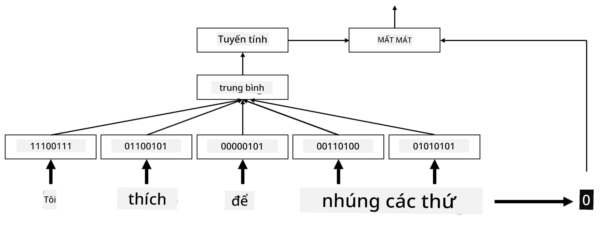
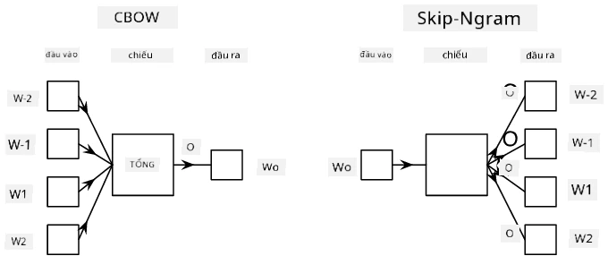

# Embedding từ

## [Câu hỏi trước bài giảng](https://ff-quizzes.netlify.app/en/ai/quiz/27)

Khi huấn luyện các bộ phân loại dựa trên BoW hoặc TF-IDF, ta đã làm việc với vector túi từ chiều cao có độ dài `vocab_size`, và đã chuyển đổi rõ ràng từ vector biểu diễn vị trí chiều thấp sang biểu diễn one-hot thưa. Tuy nhiên, biểu diễn one-hot không hiệu quả về mặt bộ nhớ. Ngoài ra, mỗi từ được xử lý độc lập, tức là vector one-hot không thể hiện sự tương đồng ngữ nghĩa nào giữa các từ.

Ý tưởng của **embedding** là biểu diễn từ bằng vector dày đặc chiều thấp hơn, phản ánh phần nào ý nghĩa ngữ nghĩa của từ. Cách xây dựng embedding có ý nghĩa sẽ được thảo luận sau; tạm thời hãy coi embedding như một cách giảm chiều của vector từ.

Lớp embedding nhận một từ làm đầu vào và tạo ra vector đầu ra có kích thước `embedding_size` được chỉ định. Theo một cách nào đó, nó rất giống lớp `Linear`, nhưng thay vì nhận vector one-hot, nó có thể nhận trực tiếp chỉ số của từ (word index) làm đầu vào, giúp tránh phải tạo các vector one-hot lớn.

Bằng cách dùng lớp embedding làm lớp đầu tiên trong mạng phân loại, ta có thể chuyển từ mô hình túi từ (bag-of-words) sang mô hình **túi embedding** (bag-of-embeddings): đầu tiên chuyển mỗi từ trong văn bản thành embedding tương ứng, sau đó tính một hàm tổng hợp trên tất cả các embedding đó, ví dụ `sum`, `average` hoặc `max`.

> Hình ảnh của tác giả

## ✍️ Bài tập: Embedding

Tiếp tục học trong các notebook sau:
* [Embedding với PyTorch](https://colab.research.google.com/github/hieubqdsm/ai-for-beginner-microsoft-vi/blob/main/lessons/5-NLP/14-Embeddings/EmbeddingsPyTorch.ipynb)
* [Embedding với TensorFlow](https://colab.research.google.com/github/hieubqdsm/ai-for-beginner-microsoft-vi/blob/main/lessons/5-NLP/14-Embeddings/EmbeddingsTF.ipynb)

## Embedding ngữ nghĩa: Word2Vec

Mặc dù lớp embedding đã học cách ánh xạ từ sang biểu diễn vector, nhưng biểu diễn này chưa chắc đã mang nhiều ý nghĩa ngữ nghĩa. Lý tưởng nhất là học được một biểu diễn vector sao cho các từ tương đồng hoặc đồng nghĩa tương ứng với các vector gần nhau theo một độ đo khoảng cách nào đó (ví dụ khoảng cách Euclid).

Để làm được điều đó, cần **tiền huấn luyện** mô hình embedding trên một kho văn bản lớn theo một cách cụ thể. Một phương pháp huấn luyện embedding ngữ nghĩa nổi tiếng là [Word2Vec](https://en.wikipedia.org/wiki/Word2vec). Nó dựa trên hai kiến trúc chính dùng để tạo biểu diễn phân tán của từ:

 - **Continuous Bag-of-Words** (CBoW) — kiến trúc này huấn luyện mô hình để dự đoán một từ dựa trên ngữ cảnh xung quanh. Với n-gram $(W_{-2},W_{-1},W_0,W_1,W_2)$, mục tiêu của mô hình là dự đoán $W_0$ từ $(W_{-2},W_{-1},W_1,W_2)$.
 - **Continuous Skip-gram** thì ngược lại với CBoW: mô hình dùng từ hiện tại để dự đoán các từ trong cửa sổ ngữ cảnh xung quanh.

CBoW huấn luyện nhanh hơn, trong khi skip-gram chậm hơn nhưng biểu diễn tốt hơn các từ hiếm.

> Hình ảnh từ [bài báo này](https://arxiv.org/pdf/1301.3781.pdf)

Các embedding Word2Vec đã tiền huấn luyện (cũng như các mô hình tương tự như GloVe) có thể được dùng thay cho lớp embedding trong mạng nơ-ron. Tuy nhiên, cần xử lý từ vựng (vocabulary), vì từ vựng dùng để tiền huấn luyện Word2Vec/GloVe có thể khác với từ vựng trong tập văn bản của bạn. Xem các notebook ở trên để biết cách giải quyết vấn đề này.

## Embedding theo ngữ cảnh

Một hạn chế chính của các embedding tiền huấn luyện truyền thống như Word2Vec là khó phân biệt nghĩa của từ. Mặc dù embedding tiền huấn luyện có nắm bắt phần nào ý nghĩa của từ theo ngữ cảnh, nhưng mọi nghĩa khả thi của một từ đều được nén vào cùng một embedding. Điều này có thể gây vấn đề ở các mô hình xuống dòng, vì nhiều từ (như 'play') có nghĩa khác nhau tùy ngữ cảnh sử dụng.

Ví dụ, từ 'play' trong hai câu sau có ý nghĩa khá khác nhau:

- Tôi đã đi xem một **vở kịch** tại nhà hát.
- John muốn **chơi** với bạn bè của mình.

Các embedding tiền huấn luyện ở trên gộp cả hai nghĩa của 'play' vào cùng một vector. Để vượt qua hạn chế này, cần xây dựng embedding dựa trên **mô hình ngôn ngữ**, được huấn luyện trên kho văn bản lớn và *hiểu* cách từ ghép lại với nhau trong các ngữ cảnh khác nhau. Thảo luận về embedding theo ngữ cảnh nằm ngoài phạm vi bài này, nhưng ta sẽ quay lại chủ đề này khi nói về mô hình ngôn ngữ ở các bài sau.

## Kết luận

Trong bài học này, bạn đã tìm hiểu cách xây dựng và sử dụng các lớp embedding trong TensorFlow và PyTorch nhằm phản ánh tốt hơn ý nghĩa ngữ nghĩa của từ.

## 🚀 Thử thách

Word2Vec đã được dùng trong một số ứng dụng thú vị, bao gồm sinh lời bài hát và thơ. Xem [bài viết này](https://www.politetype.com/blog/word2vec-color-poems) để tìm hiểu cách tác giả dùng Word2Vec để tạo thơ. Xem [video của Dan Shiffman](https://www.youtube.com/watch?v=LSS_bos_TPI&ab_channel=TheCodingTrain) để khám phá một cách giải thích khác về kỹ thuật này. Sau đó, hãy thử áp dụng các kỹ thuật này vào tập văn bản của riêng bạn (có thể lấy từ Kaggle).

## [Câu hỏi sau bài giảng](https://ff-quizzes.netlify.app/en/ai/quiz/28)

## Ôn tập & Tự học

Đọc bài báo về Word2Vec: [Efficient Estimation of Word Representations in Vector Space](https://arxiv.org/pdf/1301.3781.pdf)

## [Bài tập: Notebook](assignment.md)

---

