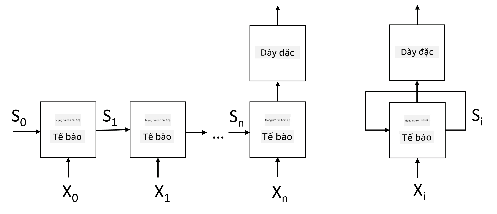
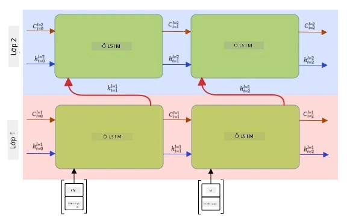

# Mạng nơ-ron hồi tiếp (RNN)

## [Câu hỏi trước bài giảng](https://ff-quizzes.netlify.app/en/ai/quiz/31)

Trong các phần trước, ta đã dùng biểu diễn ngữ nghĩa phong phú của văn bản và một bộ phân loại tuyến tính đơn giản trên các embedding. Kiến trúc này giúp nắm bắt ý nghĩa tổng hợp của các từ trong câu, nhưng bỏ qua **thứ tự** từ, vì phép tổng hợp trên embedding đã làm mất thông tin này từ văn bản gốc. Vì các mô hình này không mô hình hóa được thứ tự từ, chúng không giải quyết được các tác vụ phức tạp hoặc mơ hồ hơn như sinh văn bản hay trả lời câu hỏi.

Để nắm bắt ý nghĩa của một chuỗi văn bản, ta cần một kiến trúc mạng nơ-ron khác, gọi là **mạng nơ-ron hồi tiếp** (Recurrent Neural Network — RNN). Trong RNN, câu được đưa qua mạng từng token một, và mạng sẽ tạo ra một **trạng thái**, sau đó trạng thái này lại được đưa vào mạng cùng với token tiếp theo.

> Hình ảnh của tác giả

Với chuỗi đầu vào các token X0,...,Xn, RNN tạo ra một chuỗi các khối mạng nơ-ron và huấn luyện chuỗi này từ đầu đến cuối bằng backpropagation. Mỗi khối mạng nhận một cặp (Xi,Si) làm đầu vào và tạo ra Si+1 làm kết quả. Trạng thái cuối cùng Sn (hoặc đầu ra Yn) được đưa vào một bộ phân loại tuyến tính để tạo kết quả. Tất cả các khối mạng đều chia sẻ cùng trọng số và được huấn luyện từ đầu đến cuối bằng một lần backpropagation.

Vì các vector trạng thái S0,...,Sn được truyền qua mạng, mô hình có thể học các phụ thuộc tuần tự giữa các từ. Ví dụ, khi từ *not* xuất hiện ở đâu đó trong chuỗi, mạng có thể học cách phủ định một số phần tử trong vector trạng thái, dẫn đến phủ định ý nghĩa.

> ✅ Vì trọng số của tất cả các khối RNN trong hình trên được chia sẻ, hình này có thể được biểu diễn như một khối duy nhất (bên phải) với một vòng lặp hồi tiếp, truyền trạng thái đầu ra của mạng trở lại đầu vào.

## Cấu trúc của một cell RNN

Hãy xem cách một cell RNN đơn giản được tổ chức. Nó nhận trạng thái trước đó Si-1 và token hiện tại Xi làm đầu vào, và phải tạo ra trạng thái đầu ra Si (đôi khi ta cũng quan tâm đến một đầu ra khác Yi, như trong trường hợp các mạng sinh).

Một cell RNN đơn giản có hai ma trận trọng số bên trong: một ma trận biến đổi token đầu vào (gọi là W), và một ma trận khác biến đổi trạng thái đầu vào (H). Trong trường hợp này, đầu ra của mạng được tính bằng &sigma;(W&times;Xi+H&times;Si-1+b), trong đó &sigma; là hàm kích hoạt và b là hệ số điều chỉnh (bias).

> Hình ảnh của tác giả

Trong nhiều trường hợp, các token đầu vào được truyền qua lớp embedding trước khi vào RNN để giảm chiều dữ liệu. Khi đó, nếu kích thước vector đầu vào là *emb_size* và vector trạng thái là *hid_size*, thì kích thước của W là *emb_size*&times;*hid_size*, và kích thước của H là *hid_size*&times;*hid_size*.

## LSTM (Long Short-Term Memory)

Một vấn đề chính của RNN cổ điển là **gradient biến mất**. Vì RNN được huấn luyện từ đầu đến cuối trong một lần backpropagation, nó khó lan truyền lỗi về các lớp đầu tiên của mạng, nên không học được mối quan hệ giữa các token cách xa nhau. Một cách khắc phục là giới thiệu **quản lý trạng thái tường minh** bằng các **cổng** (gate). Có hai kiến trúc nổi tiếng thuộc loại này: **LSTM** (Long Short-Term Memory) và **GRU** (Gated Recurrent Unit).

> Nguồn hình ảnh TBD

Mạng LSTM được tổ chức tương tự như RNN, nhưng có hai trạng thái được truyền từ lớp này sang lớp khác: trạng thái ô C và vector ẩn H. Tại mỗi đơn vị, vector ẩn Hi được nối với đầu vào Xi, và chúng kiểm soát những gì xảy ra với trạng thái C thông qua các **cổng**. Mỗi cổng là một mạng nơ-ron với hàm kích hoạt sigmoid (đầu ra trong khoảng [0,1]), có thể coi như một mặt nạ bitwise khi nhân với vector trạng thái. Có các cổng sau (từ trái sang phải trong hình trên):

* **Cổng quên** (forget gate) nhận vector ẩn và xác định thành phần nào của vector C cần bỏ đi, thành phần nào cần giữ lại.
* **Cổng vào** (input gate) lấy một số thông tin từ vector đầu vào và vector ẩn, rồi đưa vào trạng thái.
* **Cổng ra** (output gate) biến đổi trạng thái qua một lớp tuyến tính với hàm kích hoạt *tanh*, sau đó chọn một số thành phần bằng vector ẩn Hi để tạo ra trạng thái mới Ci+1.

Các thành phần của trạng thái C có thể coi như các cờ hiệu có thể bật/tắt. Ví dụ, khi gặp tên *Alice* trong chuỗi, ta có thể giả định nó đề cập đến một nhân vật nữ và bật cờ trong trạng thái rằng câu có một danh từ nữ. Khi gặp thêm cụm *and Tom*, ta sẽ bật cờ rằng đây là danh từ số nhiều. Nhờ thao tác trên trạng thái, mô hình có thể theo dõi các thuộc tính ngữ pháp của các bộ phận câu.

> ✅ Một tài liệu tuyệt vời để hiểu rõ bên trong LSTM là bài viết [Understanding LSTM Networks](https://colah.github.io/posts/2015-08-Understanding-LSTMs/) của Christopher Olah.

## RNN hai chiều và nhiều lớp

Phần trên đã thảo luận về các mạng hồi tiếp hoạt động theo một hướng, từ đầu chuỗi đến cuối chuỗi. Điều này có vẻ tự nhiên, vì giống cách ta đọc và nghe. Tuy nhiên, trong nhiều trường hợp thực tế ta có thể truy cập ngẫu nhiên vào chuỗi đầu vào, nên có thể hợp lý khi tính toán hồi tiếp theo cả hai hướng. Các mạng như vậy gọi là **RNN hai chiều** (bidirectional RNN). Khi làm việc với mạng hai chiều, cần hai vector trạng thái ẩn, mỗi hướng một vector.

Một mạng hồi tiếp, dù một chiều hay hai chiều, đều nắm bắt các mẫu nhất định trong chuỗi và có thể lưu vào vector trạng thái hoặc truyền ra đầu ra. Tương tự mạng tích chập, ta có thể xây một lớp hồi tiếp khác bên trên lớp đầu tiên để nắm bắt các mẫu cấp cao hơn từ các mẫu cấp thấp do lớp đầu tiên trích xuất. Điều này dẫn đến khái niệm **RNN nhiều lớp** (multi-layer RNN), gồm hai hay nhiều mạng hồi tiếp, trong đó đầu ra của lớp trước được truyền vào lớp tiếp theo làm đầu vào.

*Hình ảnh từ [bài viết này](https://towardsdatascience.com/from-a-lstm-cell-to-a-multilayer-lstm-network-with-pytorch-2899eb5696f3) của Fernando López*

## ✍️ Bài tập: RNN

Tiếp tục học trong các notebook sau:

* [RNN với PyTorch](https://colab.research.google.com/github/hieubqdsm/ai-for-beginner-microsoft-vi/blob/main/lessons/5-NLP/16-RNN/RNNPyTorch.ipynb)
* [RNN với TensorFlow](https://colab.research.google.com/github/hieubqdsm/ai-for-beginner-microsoft-vi/blob/main/lessons/5-NLP/16-RNN/RNNTF.ipynb)

## Kết luận

Trong bài học này, ta đã thấy rằng RNN có thể được dùng cho phân loại chuỗi, nhưng thực tế chúng có thể xử lý nhiều tác vụ hơn, như sinh văn bản, dịch máy, v.v. Các tác vụ đó sẽ được xem xét trong bài học tiếp theo.

## 🚀 Thử thách

Đọc thêm một số tài liệu về LSTM và xem xét các ứng dụng:

- [Grid Long Short-Term Memory](https://arxiv.org/pdf/1507.01526v1.pdf)
- [Show, Attend and Tell: Neural Image Caption
Generation with Visual Attention](https://arxiv.org/pdf/1502.03044v2.pdf)

## [Câu hỏi sau bài giảng](https://ff-quizzes.netlify.app/en/ai/quiz/32)

## Ôn tập & Tự học

- [Understanding LSTM Networks](https://colah.github.io/posts/2015-08-Understanding-LSTMs/) của Christopher Olah.

## [Bài tập: Notebook](/lessons/5-NLP/16-RNN/assignment.md)

---

