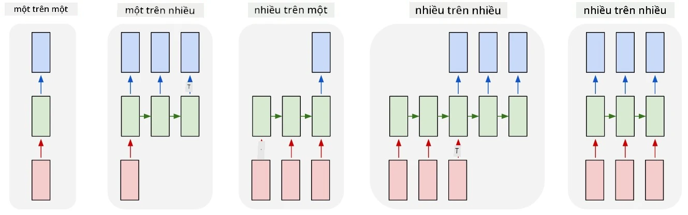
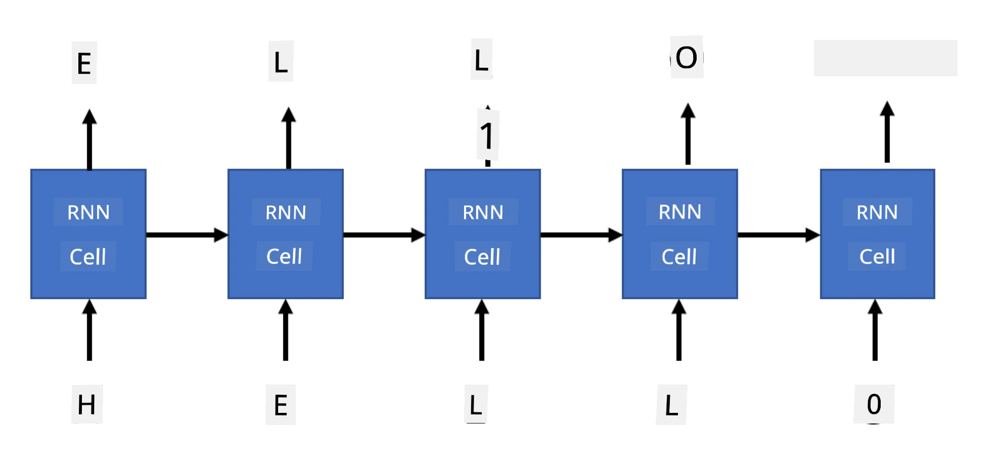

# Mạng hồi tiếp sinh

## [Câu hỏi trước bài giảng](https://ff-quizzes.netlify.app/en/ai/quiz/33)

Mạng nơ-ron hồi tiếp (RNN) và các biến thể cell có cổng như LSTM và GRU cung cấp một cơ chế để mô hình hóa ngôn ngữ, vì chúng có thể học cách sắp xếp từ và dự đoán từ tiếp theo trong chuỗi. Điều này cho phép dùng RNN cho các **tác vụ sinh**, chẳng hạn như sinh văn bản thông thường, dịch máy, và thậm chí chú thích ảnh.

> ✅ Hãy nghĩ về tất cả những lần bạn được hưởng lợi từ các tác vụ sinh như tự hoàn thành văn bản khi gõ. Tìm hiểu trong các ứng dụng yêu thích của bạn xem có dùng RNN không.

Trong kiến trúc RNN đã thảo luận ở bài trước, mỗi cell RNN tạo ra trạng thái ẩn tiếp theo làm đầu ra. Tuy nhiên, ta cũng có thể thêm một đầu ra khác tại mỗi cell hồi tiếp, cho phép xuất ra một **chuỗi** (có độ dài bằng chuỗi ban đầu). Hơn nữa, có thể dùng các cell RNN không nhận đầu vào ở mỗi bước, chỉ cần một vector trạng thái ban đầu, rồi sinh ra chuỗi đầu ra.

Điều này cho phép các kiến trúc nơ-ron khác nhau như hiển thị trong hình dưới đây:



> Hình ảnh từ bài blog [Unreasonable Effectiveness of Recurrent Neural Networks](http://karpathy.github.io/2015/05/21/rnn-effectiveness/) của [Andrej Karpathy](http://karpathy.github.io/)

* **Một-đến-một** là mạng nơ-ron truyền thống với một đầu vào và một đầu ra.
* **Một-đến-nhiều** là kiến trúc sinh nhận một giá trị đầu vào và tạo ra chuỗi giá trị đầu ra. Ví dụ, để huấn luyện mạng **chú thích ảnh** (image captioning) sinh mô tả văn bản cho một bức ảnh, ta có thể đưa bức ảnh làm đầu vào, truyền qua CNN để lấy trạng thái ẩn, và sau đó dùng một chuỗi hồi tiếp sinh chú thích từng từ một.
* **Nhiều-đến-một** tương ứng với các kiến trúc RNN đã mô tả ở bài trước, chẳng hạn như phân loại văn bản.
* **Nhiều-đến-nhiều**, hay **chuỗi-đến-chuỗi** (sequence-to-sequence), tương ứng với các tác vụ như **dịch máy**, trong đó một RNN đầu tiên thu thập tất cả thông tin từ chuỗi đầu vào vào trạng thái ẩn, và một chuỗi RNN khác giải mã trạng thái này thành chuỗi đầu ra.

Trong bài này, ta sẽ tập trung vào các mô hình sinh đơn giản giúp sinh văn bản. Để đơn giản, sẽ dùng mã hóa cấp ký tự.

Ta sẽ huấn luyện RNN này để sinh văn bản từng bước. Ở mỗi bước, lấy một chuỗi ký tự có độ dài `nchars`, và yêu cầu mạng sinh ký tự đầu ra tiếp theo cho mỗi ký tự đầu vào:



Khi sinh văn bản (trong quá trình suy luận), ta bắt đầu với một **gợi ý** (prompt), được truyền qua các cell RNN để tạo trạng thái trung gian, rồi từ trạng thái này bắt đầu quá trình sinh. Văn bản được sinh từng ký tự một, và truyền trạng thái cùng ký tự vừa sinh vào cell RNN tiếp theo để sinh ký tự kế tiếp, cho đến khi đủ số ký tự.


> Hình ảnh của tác giả

## ✍️ Bài tập: Mạng sinh

Tiếp tục học trong các notebook sau:

* [Mạng sinh với PyTorch](https://colab.research.google.com/github/hieubqdsm/ai-for-beginner-microsoft-vi/blob/main/lessons/5-NLP/17-GenerativeNetworks/GenerativePyTorch.ipynb)
* [Mạng sinh với TensorFlow](https://colab.research.google.com/github/hieubqdsm/ai-for-beginner-microsoft-vi/blob/main/lessons/5-NLP/17-GenerativeNetworks/GenerativeTF.ipynb)

## Sinh văn bản mềm và nhiệt độ

Đầu ra của mỗi cell RNN là một phân phối xác suất của các ký tự. Nếu luôn chọn ký tự có xác suất cao nhất làm ký tự tiếp theo trong văn bản được sinh, văn bản thường trở nên “lặp lại” giữa các chuỗi giống nhau, như trong ví dụ:

```
today of the second the company and a second the company ...
```

Tuy nhiên, nếu nhìn vào phân phối xác suất cho ký tự tiếp theo, có thể thấy sự khác biệt giữa một vài xác suất cao nhất không lớn, ví dụ một ký tự có xác suất 0.2, ký tự khác 0.19, v.v. Chẳng hạn, khi tìm ký tự tiếp theo trong chuỗi '*play*', ký tự tiếp theo có thể là khoảng trắng hoặc **e** (như trong từ *player*).

Điều này dẫn đến kết luận: không phải lúc nào cũng nên chọn ký tự có xác suất cao nhất, vì chọn ký tự có xác suất cao thứ hai vẫn có thể ra văn bản có ý nghĩa. Khôn ngoan hơn là **lấy mẫu** ký tự từ phân phối xác suất do mạng xuất ra. Ta cũng có thể dùng một tham số, gọi là **nhiệt độ** (temperature), để làm phẳng phân phối xác suất khi muốn thêm sự ngẫu nhiên, hoặc làm dốc hơn khi muốn bám sát các ký tự có xác suất cao nhất.

Khám phá cách sinh văn bản mềm được triển khai trong các notebook liên kết ở trên.

## Kết luận

Mặc dù sinh văn bản có thể tự thân đã hữu ích, lợi ích lớn hơn đến từ khả năng sinh văn bản bằng RNN từ một vector đặc trưng ban đầu. Ví dụ, sinh văn bản được dùng như một phần của dịch máy (chuỗi-đến-chuỗi, trong trường hợp này vector trạng thái từ *encoder* được dùng để sinh hay *giải mã* thông điệp đã dịch), hoặc sinh mô tả văn bản cho ảnh (trong trường hợp này vector đặc trưng đến từ bộ trích xuất CNN).

## 🚀 Thử thách

Học thêm trên Microsoft Learn về chủ đề này:

* Sinh văn bản với [PyTorch](https://docs.microsoft.com/learn/modules/intro-natural-language-processing-pytorch/6-generative-networks/?WT.mc_id=academic-77998-cacaste)/[TensorFlow](https://docs.microsoft.com/learn/modules/intro-natural-language-processing-tensorflow/5-generative-networks/?WT.mc_id=academic-77998-cacaste)

## [Câu hỏi sau bài giảng](https://ff-quizzes.netlify.app/en/ai/quiz/34)

## Ôn tập & Tự học

Dưới đây là một số bài viết để mở rộng kiến thức:

* Các cách tiếp cận khác nhau để sinh văn bản với Markov Chain, LSTM và GPT-2: [bài blog](https://towardsdatascience.com/text-generation-gpt-2-lstm-markov-chain-9ea371820e1e)
* Ví dụ sinh văn bản trong [tài liệu Keras](https://keras.io/examples/generative/lstm_character_level_text_generation/)

## [Bài tập](/lessons/5-NLP/17-GenerativeNetworks/lab/README.md)

Phần trên đã xem cách sinh văn bản từng ký tự một. Trong bài thực hành, bạn sẽ khám phá việc sinh văn bản ở cấp độ từ.

---

